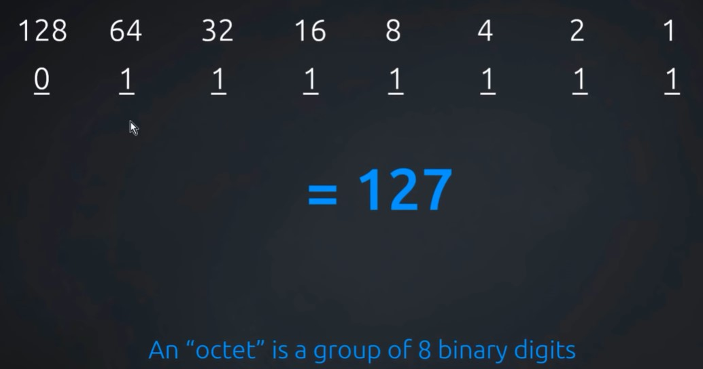
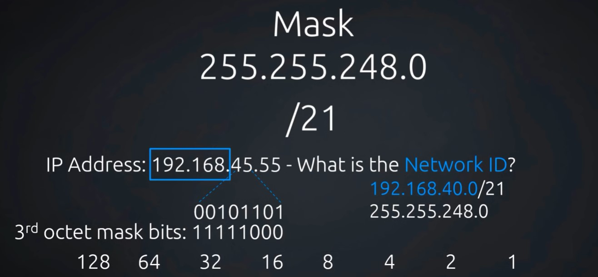
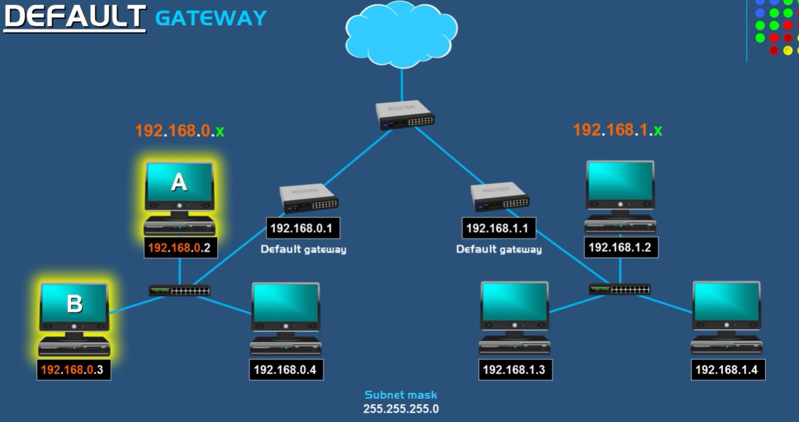

# NetPractice

## Table of Contents

| No. | Title                                                 |
| :-: | ----------------------------------------------------- |
|  1  | [Intro to IPv4 Addressing](#intro-to-ipv4-addressing) |
|  2  | [NAT Explained](#nat-explained)                       |
|  3  | [Default Gateway](#default-gateway)                   |
|  4  | [Subnet Mask](#subnet-mask)                           |
|  5  | [Other Resouces](#other-resources)                    |

---

## Notes

### Intro to IPv4 Addressing

- Binary and the IP address [Lesson 1](https://youtu.be/ddM9AcreVqY)

  

- Network ID and Subnet Masks [Lesson 2](https://youtu.be/XQ3T14SIlV4)

  

- IPv4 class systems. No idea how the **Octet range** is determined [Lesson 3](https://youtu.be/4xlzlgYGqW8)

### NAT Explained

- A router translates each private IP address to a unique public address
- [source](https://youtu.be/FTUV0t6JaDA)

### Default Gateway

- Forwards data from one network to another, it let's devices from one network, communicate with devices on another network
- Majority of the time, this is going to be a router
- If multiple devices are all in the **same network**, data doesn't have to exit through the default gateway, they can communicate with each other through the **switch**
- So how does one device know if another computer is on their own network or on a different network? **IP address and Subnet mask**
- Devices with the same **network address** are on the same network and can communicate directly with each other via the switch, rather than needing to exit the **default gateway**
- The **host address** is what's uniquely assigned to devices

  

- When device `A` & `B` are on the same network, `A` will broadcast an **ARP(Address Resolution Protocal)**, asking for `B`'s MAC address
- When device `A` & `D` aren't on the same network, `A` will broadcast an ARP, asking for the `default gateway`'s MAC address
- [source](https://youtu.be/pCcJFdYNamc)

### Subnet Mask

- It reveals how many bits in the IP address are used for the network by masking the **network** portion of the IP address
- Used to determine which portion of the IP address is used as a **Network address** or **Host address**
- IP addresses have a network and a host part, so networks ca be logically broken down into smaller networks, which is known as **subnetting**.
- Subnetting is used so prevent all devices to broadcast signals to one another, which will reduce speed
- **CIDR**-Classless Inter-Domain Routing (slash notation): `/24` = `255.255.255.0` = `11111111.11111111.11111111.00000000`
- More on how Subnet Mask is used to create _n_ number of network and _n_ number of host
- [source](https://youtu.be/s_Ntt6eTn94)

### Other Resources

- [Cisco - IP Addressing and Subnetting](https://www.cisco.com/c/en/us/support/docs/ip/routing-information-protocol-rip/13788-3.html#anc9)
